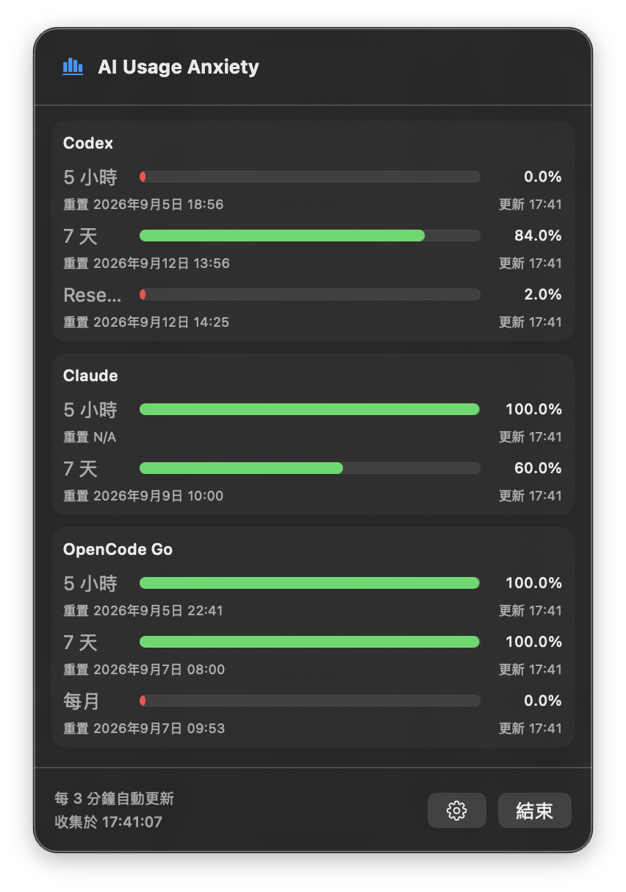

<p align="center">
  
</p>

# AI Usage Anxiety

在 macOS 選單列查看 AI 服務還剩多少額度，省去切換不同工具查詢的步驟。

AI Usage Anxiety 使用 SwiftUI 製作原生選單列介面，搭配內嵌 Go helper 收集用量。點一下選單列圖示，即可查看 Codex、Claude 與 OpenCode Go 的剩餘百分比、額度條及重置時間。

## 畫面預覽

<p align="center">
  
</p>

畫面為示意截圖，額度與時間依帳號及查詢結果變動；截圖中的標題圖示為舊版設計。

## 功能

- 同屏顯示 Codex 的 5 小時、7 天、Reserve；Claude 的 5 小時、7 天；OpenCode Go 的 5 小時、7 天、每月額度。
- App 執行期間每 3 分鐘自動更新，關閉彈出面板後仍持續收集。
- 額度條顯示**剩餘百分比**；預設已用達 75% 顯示橘色，達 90% 顯示紅色。
- 在設定中新增、修改或刪除 OpenCode Go API key，金鑰存放於 macOS Keychain。
- 無法取得額度時顯示 `N/A`；有效的零剩餘額度顯示 `0%`，較舊的可用快照會標示「舊資料」。

## 系統需求

| 項目 | 需求 |
| --- | --- |
| 執行環境 | Apple Silicon Mac；最低部署目標 macOS 13 |
| 原始碼建置 | Go 1.22 或更新版本（啟用 CGO）、提供 `swiftc` 與 C 編譯器的 Xcode Command Line Tools |
| Codex | 已安裝並登入的 Codex CLI；即時查詢使用本機 app-server |
| Claude | 已登入的 Claude Code；即時查詢需可存取其 Keychain OAuth 憑證 |
| OpenCode Go | 有效的 OpenCode Go API key |

可只使用其中一家服務；缺少登入資料或 key 時，其他服務仍可收集。執行已建置的 `.app` 不需要安裝 Go。

目前建置腳本固定產生 arm64 的 Swift 執行檔，請在 Apple Silicon Mac 建置；尚未提供 Intel 或 Universal 建置流程。

## 從原始碼建置

下載或 clone 此專案後，在專案根目錄執行：

```sh
# 尚未安裝 Command Line Tools 時執行
xcode-select --install

# 確認建置工具
go version
xcrun swiftc --version

# 建置 App 與命令列 helper
bash macos/build.sh

# 啟動
open "outputs/AI Usage Anxiety.app"
```

建置產物：

| 路徑 | 內容 |
| --- | --- |
| `outputs/AI Usage Anxiety.app` | 可執行的選單列 App，內含 Go helper 與 App 圖示 |
| `bin/aiusage` | 可獨立執行的命令列工具 |

建置腳本使用本機 ad-hoc 簽章，尚未進行 Developer ID 簽章或 Apple 公證。這不等同可直接公開發行的已公證 App；從其他電腦下載的版本可能受到 Gatekeeper 阻擋。

## 使用方式

1. 開啟 `AI Usage Anxiety.app`，點選 macOS 選單列圖示。App 不顯示 Dock 圖示或獨立主視窗。
2. 查看各服務的剩餘額度與重置時間。首次開啟直接顯示儀表板；沒有 OpenCode Go key 時，該服務顯示 `N/A`。
3. 點選右下角齒輪，在「OpenCode Go API key」輸入金鑰並按「儲存」。修改已存金鑰時按「儲存修改」。
4. 要停止 OpenCode Go 查詢，在設定按「刪除 API key」並確認。此操作只刪除本機副本，不撤銷服務端金鑰；重新設定前不再查詢。
5. 使用完畢可關閉面板，App 仍在背景更新；按「結束」才會停止 App。

## 資料來源與時效

| 服務 | 優先來源 | 無法取得時 |
| --- | --- | --- |
| Codex | 本機 Codex CLI app-server 的 `account/rateLimits/read` | 回退本機 JSONL 紀錄 |
| Claude | 使用 Claude Code Keychain OAuth 憑證查詢官方 usage endpoint | 回退本機紀錄 |
| OpenCode Go | 使用設定的 API key 查詢官方 usage endpoint | 顯示 `N/A` |

Codex Reserve 取自獨立的 `gpt-reserve` 額度，不與一般 7 天額度合併；來源未提供時顯示 `N/A`。

Claude access token 過期時，App 會嘗試以既有 refresh token 更新，並將更新後的憑證寫回 Claude Code Keychain 項目。背景 Keychain 操作不要求認證提示；無法存取或更新時回退本機來源。

來源超過 9 分鐘但重置時間尚未到時，可保留最後數值並標示「舊資料」。來源缺失、格式無法辨識或重置時間已過時顯示 `N/A`。畫面上的「收集於」是本輪收集時間，不代表舊資料已變成即時數值。

這是獨立工具，未宣稱由各服務供應商開發或背書。CLI 內部紀錄與服務端回應格式變更可能影響查詢結果。

## 憑證處理

OpenCode Go API key 存放於 macOS Keychain。原生 App 透過標準輸入將查詢憑證傳給內嵌 helper，不將憑證放入命令列參數。CLI 讀取與儲存金鑰也使用原生 Keychain API，不以程序參數或暫存檔傳遞金鑰。CLI 無法隱藏輸入時會停止讀取；不支援直接將 key 透過 shell pipe 輸入，請改用 App 設定。Claude 登入由 Claude Code 管理，App 設定頁不要求輸入 Claude token。

## 命令列模式

```sh
# 終端儀表板；Ctrl-C 離開
./bin/aiusage

# 輸出一次 JSON 快照
./bin/aiusage --json
```

命令列模式在缺少 OpenCode Go key 時可能要求輸入。原生 App 負責 Claude Keychain OAuth 流程；直接執行 CLI 時，Claude 使用本機紀錄，結果可能與 App 不同。

## 測試

```sh
# Go race tests、go vet，以及 Swift Core／OAuth fixture／Store 測試
bash macos/test.sh

# 額外執行原生 Keychain CRUD 測試，使用隨機測試 service
bash macos/test.sh --keychain

# 額外驗證 Go CLI 原生 Keychain，僅使用隨機測試項目
AIUSAGE_TEST_KEYCHAIN=1 go test ./internal/auth -run TestNativeKeychainRoundTrip
```

自動化測試不等同真實帳號與 UI 驗收。公開發行前仍需確認 macOS 13 實機、Claude 真實 OAuth 更新、睡眠喚醒與背景更新，以及正式簽章和公證。

## 常見問題

| 問題 | 檢查方式 |
| --- | --- |
| 開啟後沒有視窗 | 點選 macOS 選單列圖示；此 App 使用彈出面板 |
| Codex 顯示 `N/A` 或舊資料 | 確認 Codex CLI 已安裝且登入，並能取得目前帳號額度 |
| Claude 顯示 `N/A` 或舊資料 | 先確認 Claude Code 登入有效；Keychain 不可存取或官方查詢失敗時會回退本機紀錄 |
| OpenCode Go 顯示 `N/A` | 在設定確認 key 有效；沒有可辨識的額度資料時不推算百分比 |
| 找不到 `go` 或 `swiftc` | 安裝 Go 與 Xcode Command Line Tools，再重新執行建置 |

## 專案結構

```text
cmd/aiusage/         CLI 與 JSON bridge
internal/           供應商查詢、收集、設定、憑證與終端介面
macos/AIUsage/      SwiftUI 選單列 App
macos/Resources/    macOS App 圖示
macos/Tests/        Swift 測試
docs/assets/        README 圖片
```

## 授權

本專案採用 [MIT License](LICENSE) 授權。
